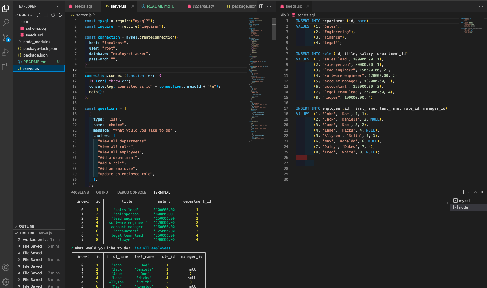

# SQL Employee Tracker

### **Table of Contents**

- Description
- Github Profile
- Video Link

### **Description**

This employee tracker was created as a content management system command-line application. The app allows for users to view departments, roles, and employees using the mySQL database. Users are also able to add employees, roles, or departments to the system, as well as update employees that already exist.

### Github Profile

https://github.com/rosa-alonso/SQL-Employee_Tracker/

### **Video Link**

https://watch.screencastify.com/v/BJSG3lurY8dv0OiwASnF
